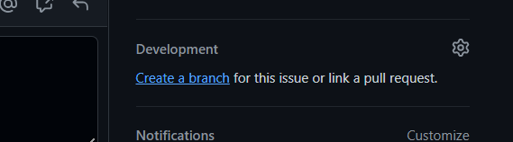

### How to contribute to the project?

### Create new issue
1. Add a new issue to the issue tracker.  

2. Add title and description to the new issue. If you know who should be responsible for the issue you can assign it to the user.  

3. Apply label and choose project for this issue (in this case choose `KST Smog Tracker` as the project - then issue will appear on the [board](https://github.com/orgs/SMOG-Devs/projects/1)).
4. Submit created issue.
5. If you want to work on this issue, assign it to yourself.

### Work on the issue
1. Find `Development` section and click `Create a branch`.  
It will create new branch dedicated to this issue. Created branch will be connected to this issue and when Pull request 
associated with this branch is merged, issue will automatically be resolved (nice).   

2. Switch to the branch and make changes in the code.
3. Commit changes to the branch.  
Remember to write meaningful, concise `commit messages` describing what's been added/changed.  

4. If you solved the issue and work is done, open Pull request. 
When you open Pull request section you will see that prompt will suggest you to open Pull request.  
(If there's no prompt associated with your branch, you can open Pull request manually with `New pull request` button.)  

5. Add title and description to the Pull request, and also  assignees and code reviewers.  
6. Assign min. one of team members to conduct the `code review`.  
`Never` merge Pull request without approval of all assigned reviewers. Reviewers will check if the code is free of errors/bugs etc. and if it's written in a good way.  
7. If everything is fine, reviewers will approve the changes.  

8. If all reviewers approve the changes, feel free to merge the changes. Done.